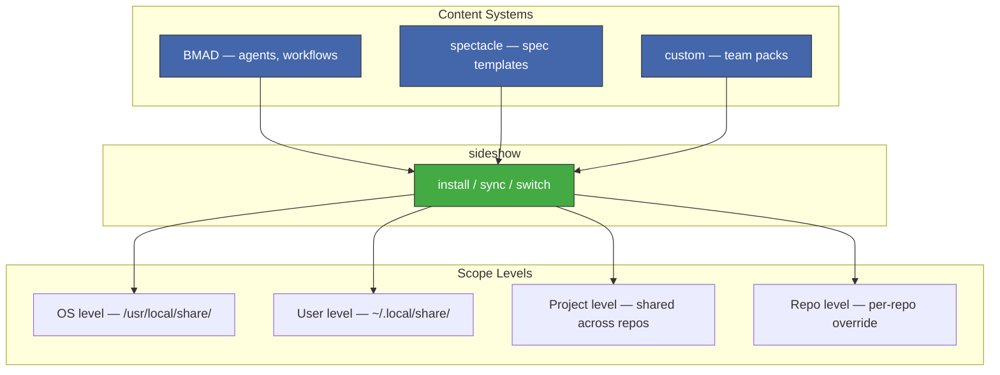
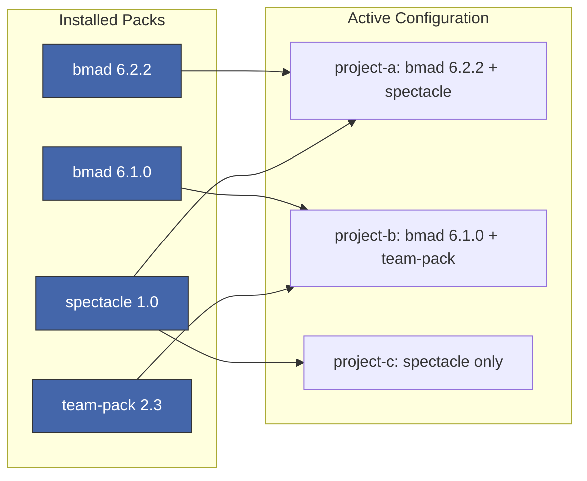

# sideshow

Content pack manager for AI CLI tools.

## Why

AI CLI tools load agent personas, workflows, templates, and commands from
the project directory. Different tools ship different content systems —
BMAD has agents and workflows, spectacle has IEEE spec templates, teams
build their own custom packs. Today each repo gets its own copy of each
system. Across an organization:

- Content is duplicated dozens of times at different versions
- Updates require touching every repo
- No way to compose packs from different systems together
- No separation between pack content (read-only) and project customization

This was pennyfarthing's fatal flaw — per-repo installation that never
became a distributable tool.

## What sideshow does

sideshow manages content packs from different systems at different scopes.
Multiple packs coexist. Multiple versions of the same pack coexist.
You control what's active where.



### Scope levels

Packs can be installed at four levels. The first three are shared across
multiple projects — install once, use everywhere.

| Scope | Location | Shared? | Use case |
|-------|----------|---------|----------|
| **OS** | `/usr/local/share/sideshow/` | All users on the machine | Workstations, CI runners |
| **User** | `~/.local/share/sideshow/` | All projects for this user | Personal defaults |
| **Project** | `<project>/sideshow/` | One project, all repos | Org-wide packs |
| **Repo** | `<repo>/_bmad/` | One repo | Per-repo overrides |

Lower scopes override higher. A repo-level pack overrides the same pack
at user level.

### Multi-pack, multi-version



- Install multiple content packs simultaneously — BMAD and spectacle
  side by side, each providing their own agents and commands
- Install multiple versions of the same pack — bmad 6.2.2 at user level,
  bmad 6.1.0 pinned in a specific repo
- Switch which version is active with a single command — swap a project
  from one version to another without reinstalling
- Roll back instantly when an update breaks something

### Content systems

sideshow is pack-agnostic. Any content that follows the pattern
"agents + workflows + templates loaded by an AI CLI tool" is a pack.

| System | What it provides | Status |
|--------|-----------------|--------|
| **BMAD** | Agent personas, workflows, init system | Working |
| **spectacle** | IEEE/ISO spec templates, Claude Code commands | Planned |
| **Custom packs** | Team-specific agents, workflows, templates | Planned |

## Installation

```bash
# From source
go install github.com/ArcavenAE/sideshow/cmd/sideshow@latest

# Homebrew (when releases are available)
brew install arcavenae/tap/sideshow
```

## Usage

```bash
# Install a content pack
sideshow install bmad --from ~/work/project/_bmad

# Sync commands to the AI tool's global command directory
sideshow commands sync

# Create per-project config so agents can activate
sideshow init --user "Michael"

# Check what's installed
sideshow list
sideshow status
```

## Project status

### Done

- Pack installation from local path with version detection
- Version-tracked registry with `current` symlink
- Command sync with path rewriting (global vs per-repo separation)
- Claude Code permission management
- Init command — config shim satisfies BMAD's init gate

### To do

- Scope levels beyond user — OS, project, repo (#4, #7)
- Pack sources beyond local path — git, registry (#3)
- Version switching — change active version per scope
- Multi-pack composition — load and merge multiple packs
- Three-layer customization — core, global custom, per-repo custom (#7)
- `sideshow update` and `sideshow remove`
- Marvel workspace integration (#5)

## License

MIT
