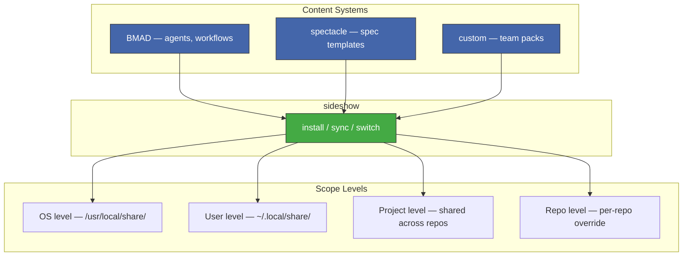
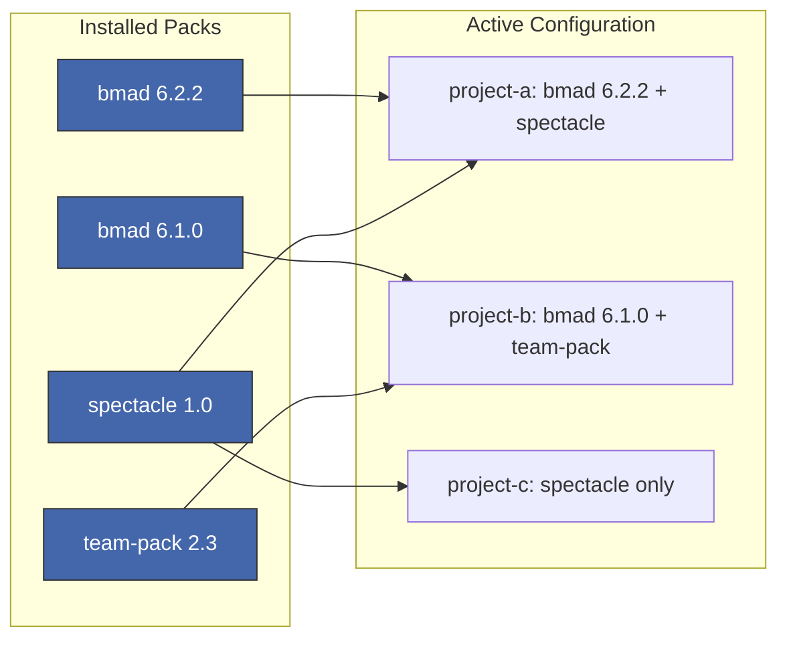

# sideshow

Content pack manager for AI CLI tools.

## Why

AI CLI tools load agent personas, workflows, templates, and commands from
the project directory. Different tools ship different content systems —
BMAD has agents and workflows, spectacle has IEEE spec templates, teams
build their own custom packs. Today each repo gets its own copy of each
system. Across an organization:

- Content is duplicated dozens of times at different versions
- Updates require touching every repo
- No way to compose packs from different systems together
- No separation between pack content (read-only) and project customization

This was pennyfarthing's fatal flaw — per-repo installation that never
became a distributable tool.

## What sideshow does

sideshow manages content packs from different systems at different scopes.
Multiple packs coexist. Multiple versions of the same pack coexist.
You control what's active where.


```mermaid
graph TB
    subgraph "Content Systems"
        BMAD[BMAD — agents, workflows]
        SPEC[spectacle — spec templates]
        CUSTOM[custom — team packs]
    end

    subgraph "sideshow"
        S[install / sync / switch]
    end

    subgraph "Scope Levels"
        OS["OS level — /usr/local/share/"]
        USER["User level — ~/.local/share/"]
        PROJECT["Project level — shared across repos"]
        REPO["Repo level — per-repo override"]
    end

    BMAD --> S
    SPEC --> S
    CUSTOM --> S
    S --> OS
    S --> USER
    S --> PROJECT
    S --> REPO

    style S fill:#4a4,stroke:#333,color:#fff
    style BMAD fill:#46a,stroke:#333,color:#fff
    style SPEC fill:#46a,stroke:#333,color:#fff
    style CUSTOM fill:#46a,stroke:#333,color:#fff
```

### Scope levels

Packs can be installed at four levels. The first three are shared across
multiple projects — install once, use everywhere.

| Scope | Location | Shared? | Use case |
|-------|----------|---------|----------|
| **OS** | `/usr/local/share/sideshow/` | All users on the machine | Workstations, CI runners |
| **User** | `~/.local/share/sideshow/` | All projects for this user | Personal defaults |
| **Project** | `<project>/sideshow/` | One project, all repos | Org-wide packs |
| **Repo** | `<repo>/_bmad/` | One repo | Per-repo overrides |

Lower scopes override higher. A repo-level pack overrides the same pack
at user level.

### Multi-pack, multi-version


```mermaid
graph LR
    subgraph "Installed Packs"
        B1["bmad 6.2.2"]
        B2["bmad 6.1.0"]
        SP["spectacle 1.0"]
        T["team-pack 2.3"]
    end

    subgraph "Active Configuration"
        PROJ_A["project-a: bmad 6.2.2 + spectacle"]
        PROJ_B["project-b: bmad 6.1.0 + team-pack"]
        PROJ_C["project-c: spectacle only"]
    end

    B1 --> PROJ_A
    SP --> PROJ_A
    B2 --> PROJ_B
    T --> PROJ_B
    SP --> PROJ_C

    style B1 fill:#46a,stroke:#333,color:#fff
    style B2 fill:#46a,stroke:#333,color:#fff
    style SP fill:#46a,stroke:#333,color:#fff
    style T fill:#46a,stroke:#333,color:#fff
```

- Install multiple content packs simultaneously — BMAD and spectacle
  side by side, each providing their own agents and commands
- Install multiple versions of the same pack — bmad 6.2.2 at user level,
  bmad 6.1.0 pinned in a specific repo
- Switch which version is active with a single command — swap a project
  from one version to another without reinstalling
- Roll back instantly when an update breaks something

### Content systems

sideshow is pack-agnostic. Any content that follows the pattern
"agents + workflows + templates loaded by an AI CLI tool" is a pack.

| System | What it provides | Status |
|--------|-----------------|--------|
| **BMAD** | Agent personas, workflows, init system | Working |
| **spectacle** | IEEE/ISO spec templates, Claude Code commands | Planned |
| **Custom packs** | Team-specific agents, workflows, templates | Planned |

## Installation

### Option 1: Homebrew (macOS/Linux)

```bash
brew install arcavenae/tap/sideshow
```

The tap formula currently tracks the latest alpha build; a first stable release is pending.

### Option 2: Install with mise

[mise](https://mise.jdx.dev/) is a polyglot version manager. It reads a per-project `mise.toml`, pulls the exact signed binary from GitHub Releases, and verifies GitHub Artifact Attestations natively — no Homebrew tap required.

**Stable:**

```bash
mise use github:ArcavenAE/sideshow@latest
sideshow version
```

Note: a first stable (`v*`) release is pending — until then, this command reports "no versions found". Use the alpha channel below to install from source releases.

**Alpha channel** (prereleases from `main`) — add `prerelease = true` to opt in per-tool. Sideshow's alpha binaries are not `-a`-suffixed, so stable and alpha share the `sideshow` shim name (they cannot be installed side-by-side under mise; the alpha channel replaces the stable channel per-project):

```toml
# mise.toml
[tools]
"github:ArcavenAE/sideshow" = { version = "latest", prerelease = true }
```

```bash
mise install
sideshow version
```

**macOS troubleshooting** — mise downloads over HTTP libraries that do not set `com.apple.quarantine`, so notarized binaries launch without a Gatekeeper prompt in the common case. If a quarantine-aware host (some IDEs, launchers, or file-manager copies) propagates the xattr into the mise install, clear it once:

```bash
xattr -d com.apple.quarantine "$(mise which sideshow)"
```

**Platform note** — sideshow's release pipeline currently builds `darwin/amd64`, `darwin/arm64`, and `linux/amd64`. `linux/arm64` is not yet published; mise will report no matching asset on that platform.

### Option 3: Install from source

```bash
go install github.com/ArcavenAE/sideshow/cmd/sideshow@latest
```

## Quickstart

```bash
# Install a pack version into the user store (does not change what's active)
sideshow install bmad --from ~/Downloads/bmad-6.10.0 --no-activate

# See every installed version; * marks the active one
sideshow list

# Activate a version: flips `current`, re-syncs bindings, and removes
# stale artifacts the outgoing version left behind
sideshow use bmad 6.10.0

# Wire a repo you work in: creates the _bmad/ runtime shim (symlinks the
# read surfaces upstream resolvers expect) + the _bmad-custom/ bridge +
# gitignore entries, and registers the repo as a custom-skills source.
# Run once per repo.
cd ~/work/myrepo && sideshow project init bmad

# Stop serving a repo's custom skills (throwaway checkout, wrong-dir
# init): removes it from the source registry; the next sync withdraws
# its skills. Note that syncing from inside a repo that still carries
# _bmad-custom/skills/ re-registers it.
sideshow project unregister bmad --repo /tmp/scratch-checkout

# Verify bindings are fully synced
sideshow status
```

Full walkthrough with signed-release verification and a roster test:
[`examples/bmad/`](examples/bmad/README.md). How pack content finds its
paths (rewriting vs shim vs fallback): [`docs/path-resolution.md`](docs/path-resolution.md).

## Plugin-shaped packs (repo bindings)

Packs that upstream ships as a claude plugin (vsdd-factory) install
into the same store but activate per repo, never machine-wide:

```bash
# Activate in one repo: skills/agents materialize prefixed under
# .claude/, hook chain and env shim register in the settings chain,
# a ledger row records everything written
cd ~/work/myrepo && sideshow enable vsdd-factory@1.0.0-rc.23

# Read-only preflight / posture checks
sideshow coexist-check vsdd-factory     # ten-check enable/adopt preflight
sideshow coexist vsdd-factory           # foreign-install census + findings

# Consented persona flip (enable never touches your default agent)
sideshow activate vsdd-factory          # default agent -> vsdd-orchestrator
sideshow deactivate vsdd-factory        # remove the flip only

# Exact reversal: replays the enable record in reverse, byte-exact
sideshow disable vsdd-factory

# Convert a repo already on the claude plugin channel (reversible,
# dry-runnable; the plugin install itself is never touched)
sideshow adopt vsdd-factory --dry-run
sideshow adopt vsdd-factory
sideshow adopt vsdd-factory --finish    # print-only residue report
```

Runbook: [`docs/repo-bindings-enablement.md`](docs/repo-bindings-enablement.md).
Why this channel exists and what it deliberately does differently:
[`docs/unshaping-spec.md`](docs/unshaping-spec.md),
[`docs/divergence-register.md`](docs/divergence-register.md).
Upstream state that constrains this channel, per release:
[`docs/upstream-notes-vsdd-factory.md`](docs/upstream-notes-vsdd-factory.md).

## Project status

### Done

- Pack installation from local path with version detection; `--no-activate`
- Multi-version store with `current` symlink; `sideshow use` version switching
- Sync with ownership ledger — activation flips remove stale bindings
- Runtime shim (`runtime_links`) + customization bridge (`custom_bridge`)
  — upstream `{project-root}/_bmad/` resolvers work per-repo
- Command/skill sync with path rewriting + read-only fallback footer
- Claude Code permission management
- Init command — config shim satisfies BMAD's init gate
- Repo-bindings channel for plugin-shaped packs — per-repo
  enable/disable (exact ledger replay), coexistence census + ten-check
  preflight, consented persona flip, adopt from the claude-mp channel
  with equivalence reporting

### To do

- Fetch + verify packs directly from signed releases (aae-orc-wk92)
- Per-scope activation declaration, .tool-versions-style (aae-orc-76sh)
- Store immutability at install; doctor verification (aae-orc-dihj, xteh)
- Cross-pack collision detection at sync (aae-orc-em8e)
- Multi-pack composition; three-layer customization (#7)
- `sideshow update` and `sideshow remove`
- Marvel workspace integration (#5)

## License

MIT
